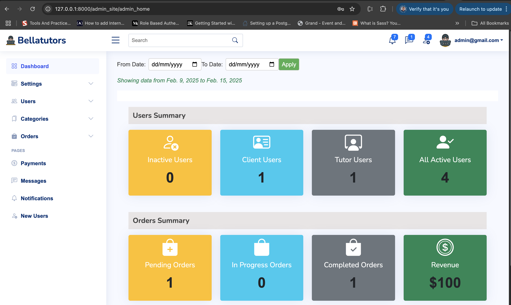
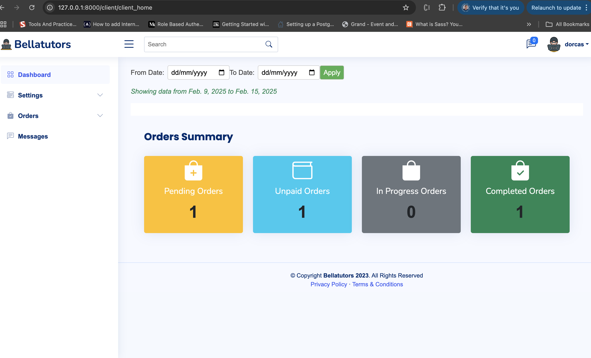

# BellaTutors

BellaTutors is a Django-based tutor-client management system that allows clients to submit work requests, which are then assigned to tutors by an admin. The application streamlines task management, making it easier for tutors to complete assignments and for clients to receive their work efficiently.

## Features

- **Client Dashboard**: Clients can submit work requests and track their progress.  
- **Admin Panel**: The admin assigns tasks to available tutors and manages users.  
- **Tutor Dashboard**: Tutors can view assigned tasks and submit completed work.  
- **Authentication & Authorization**: Secure login for clients, tutors, and admins.  
- **Notifications**: Email or system notifications for task updates.  
- **Task Management**: Task submission, status tracking, and completion workflow.  

## Technologies Used

- **Django** - Backend framework  
- **Django REST Framework (DRF)** - API development  
- **PostgreSQL/MySQL** - Database  
- **HTML, CSS, JavaScript** - Frontend  
- **Bootstrap** - UI styling  

## Installation & Setup

1. Clone the repository:  
   ```bash
   git clone https://github.com/your-username/BellaTutors.git
   cd BellaTutors
   ```

2. Create and activate a virtual environment:  
   ```bash
   python -m venv venv
   source venv/bin/activate  # On Windows use `venv\Scripts\activate`
   ```

3. Install dependencies:  
   ```bash
   pip install -r requirements.txt
   ```

4. Apply database migrations:  
   ```bash
   python manage.py migrate
   ```

5. Create a superuser:  
   ```bash
   python manage.py createsuperuser
   ```

6. Run the development server:  
   ```bash
   python manage.py runserver
   ```

7. Access the application:  
   - Client/Tutor interface: `http://127.0.0.1:8000/`  
   - Admin panel: `http://127.0.0.1:8000/admin/`  

## Screenshots
   
   
   

## Contributing

If you'd like to contribute to BellaTutors, please fork the repository, create a feature branch, and submit a pull request.

## License

This project is licensed under the MIT License.
